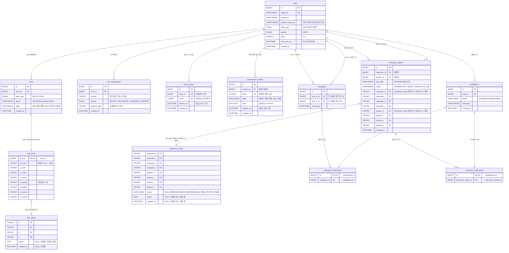

# MyCPT 데이터베이스 설계 문서

**문서 버전**: v0.12
**작성일**: '26.06.24.
**작성자**: 김유신

---

## 변경 이력

| 버전  | 변경 내용                                                                                                                                                                                                                            | 날짜       |
| ----- | ------------------------------------------------------------------------------------------------------------------------------------------------------------------------------------------------------------------------------------ | ---------- |
| v0.1  | 초안 작성 (9개 테이블)                                                                                                                                                                                                               | '26.05.23. |
| v0.2  | `test_results`에 `rater_type`, `label` 컬럼 추가. `assessment_tokens` 테이블 신규 추가 (10개 테이블). 배치 작업에 만료 토큰 삭제 통합. 통계 집계 기준 명시.                                                                          | '26.05.24. |
| v0.3  | `chemistry_reports` DISC 버킷 스냅샷 컬럼 제거. `test_type VARCHAR(20)` 컬럼 추가로 다중 검사 유형 확장성 확보.                                                                                                                      | '26.05.24. |
| v0.4  | `disc_cache` 섹션별 TEXT 6개 → `report TEXT` 단일화 (Markdown). `chemistry_reports` 동일 적용. `statistics` 테이블 제거 (MVP에서 직접 집계 쿼리로 대체).                                                                             | '26.05.24. |
| v0.5  | `test_results` → `tests` (헤더) + `disc_results` (DISC 전용) 로 분리. Class Table Inheritance 패턴 적용으로 검사 유형 확장성 확보. 테이블 수 9 → 10.                                                                                 | '26.05.25. |
| v0.6  | `users.profile_image_key` → `profile_image_url` 변경. Full URL 저장 방식으로 통일.                                                                                                                                                   | '26.05.26. |
| v0.7  | 검사 결과 버킷을 9단계에서 3단계로 수정.                                                                                                                                                                                             | '26.06.01. |
| v0.8  | `disc_cache` 초기화 시드 스크립트 추가 (81개 행 사전 삽입).                                                                                                                                                                          | '26.06.03. |
| v0.9  | `disc_results` → `disc_tests` 이름 변경. `tests.test_type` 제거 → `dtype` 추가 (JPA `@DiscriminatorColumn`). `notifications` CTI 적용 (`colleague_notifications`, `chemistry_notifications` 서브타입 분리). 테이블 수 10 → 12.       | '26.06.15. |
| v0.10 | `chemistry_reports.report` NOT NULL → NULL 변경. `status ENUM('GENERATING','READY','ERROR')` 컬럼 추가.                                                                                                                              | '26.06.22. |
| v0.11 | `chemistry_cache` 테이블 추가 (케미 보고서 Lazy Caching. 복합 PK 8개 버킷값).                                                                                                                                                        | '26.06.22. |
| v0.12 | `chemistry_cache` 사전 삽입 방침 변경 (6,561행 seeding). `status VARCHAR(20)` 컬럼 추가 (NULL→GENERATING→READY 락 라이프사이클). `chemistry_reports.status` 초기값 GENERATING → NULL 로 변경 (chemistry_cache 락 이후 INSERT되므로). | '26.06.24. |

---

## 목차

- [MyCPT 데이터베이스 설계 문서](#mycpt-데이터베이스-설계-문서)
  - [변경 이력](#변경-이력)
  - [목차](#목차)
  - [1. 개요](#1-개요)
    - [1.1 테이블 목록](#11-테이블-목록)
    - [1.2 설계 원칙](#12-설계-원칙)
  - [2. ERD](#2-erd)
  - [3. 테이블 명세 (DBML)](#3-테이블-명세-dbml)
  - [4. 인덱스 전략](#4-인덱스-전략)
  - [5. 배치 작업](#5-배치-작업)

---

## 1. 개요

### 1.1 테이블 목록

| 테이블                    | 설명                       | 비고                                                           |
| ------------------------- | -------------------------- | -------------------------------------------------------------- |
| `users`                   | 회원 정보                  | 카카오 OAuth 기반                                              |
| `tests`                   | 검사 응시 헤더 (공통)      | JPA `@Inheritance(JOINED)` 부모. `dtype` 식별자                |
| `disc_tests`              | DISC 검사 전용 결과        | `tests` JOINED 상속 자식. 원점수 + 버킷값                      |
| `disc_cache`              | DISC 버킷 기반 보고서 캐시 | Markdown 단일 TEXT, 온디맨드 만료                              |
| `coin_transactions`       | 코인 충전/차감 이력        | 이상 감지 및 CS 대응 용도                                      |
| `peer_codes`              | 동료 초대 코드             | 대문자+숫자 8자리, 7일 만료                                    |
| `assessment_tokens`       | 타인 평정 일회용 링크 토큰 | 7일 만료, 단 1회 사용 가능                                     |
| `colleagues`              | 동료 관계                  | 단일 행 양방향, 작은 ID → user_a                               |
| `chemistry_reports`       | 케미 보고서                | Markdown 단일 TEXT, 검사 유형 확장 가능                        |
| `chemistry_cache`         | 케미 보고서 버킷 기반 캐시 | 복합 PK (requester 4축 + partner 4축). 순수 Lazy. 최대 6,561행 |
| `notifications`           | 인앱 알림 공통 헤더        | JPA `@Inheritance(JOINED)` 부모. 클릭 시 즉시 삭제             |
| `colleague_notifications` | 동료 등록 알림             | `notifications` JOINED 상속 자식                               |
| `chemistry_notifications` | 케미 보고서 알림           | `notifications` JOINED 상속 자식                               |

### 1.2 설계 원칙

- **JPA `@Inheritance(JOINED)`** — `tests`가 응시 헤더(공통), `disc_tests`가 DISC 전용 확장. `dtype` 컬럼을 `@DiscriminatorColumn`으로 사용하여 코드가 유효 값의 범위를 보장. MBTI/Big5 추가 시 `mbti_tests`, `big5_tests` 테이블과 엔티티만 신규 추가. `tests` 스키마 변경 없음.
- **`notifications` 동일 패턴 적용** — `colleague_notifications`, `chemistry_notifications`가 각각 `colleagues.id`, `chemistry_reports.id`에 FK를 보유. 기존 `reference_id BIGINT` 방식(타입 불안전, FK 불가)을 대체.
- 보고서 원문(`disc_cache.report`, `chemistry_reports.report`)은 Markdown 형식 단일 TEXT로 저장. 이름 미포함. 렌더링 시 이름 삽입.
- 비회원 검사 결과는 클라이언트 sessionStorage에 원점수 임시 보관 후 로그인 시 서버로 전송 (서버 세션 미사용 — 플러딩 방어).
- `disc_tests`는 원점수 + 버킷값을 함께 저장하여 `disc_cache` 복합 FK 참조 무결성 보장.
- `disc_cache`는 행 DELETE 없이 UPDATE로 갱신 — FK 참조가 절대 깨지지 않음.
- `colleagues`는 `user_a_id < user_b_id` 규칙으로 UNIQUE 제약만으로 중복 방지.
- `chemistry_reports`는 DISC 버킷 스냅샷 미저장 — Markdown 보고서 텍스트가 성향 정보를 충분히 포함.
- `statistics` 테이블 없음 — MVP에서 `tests JOIN disc_tests` 직접 집계 쿼리로 대체. 사용자 수만 명 초과 시점에 집계 테이블 또는 Redis 캐싱 도입 검토.
- `assessment_tokens`는 `used=TRUE` 처리로 중복 제출 방지. 만료 토큰은 `peer_codes` 배치와 통합 삭제.
- `disc_cache`는 초기화 스크립트에 의해 3^4=81개 행이 `report=NULL`로 사전 삽입됨. 최초 조회 시 LLM을 호출해 UPDATE. 이로써 `disc_tests → disc_cache` FK 제약이 항상 만족됨.

---

## 2. ERD



---

## 3. 테이블 명세 (DBML)

```dbml
// ============================================================
// Enums
// ============================================================

Enum gender_enum {
  M [note: '남성']
  F [note: '여성']
  N [note: '선택 안 함']
}

Enum rater_type_enum {
  SELF  [note: '자기 평정']
  OTHER [note: '타인 평정']
}

Enum coin_reason_enum {
  SIGNUP           [note: '가입 시 초기 지급']
  RECHARGE         [note: '24시간 주기 온디맨드 충전']
  CHEMISTRY_REPORT [note: '케미 보고서 발행 차감']
}

Enum chemistry_report_status_enum {
  GENERATING [note: 'LLM 호출 중. report = NULL']
  READY      [note: '발행 완료. report = TEXT']
  ERROR      [note: 'LLM 실패. report = NULL. 코인 환불됨']
}

// chemistry_cache: 복합 PK (requester 4축 + partner 4축) 기반 Lazy Caching
//6,561행(81×81) 사전 삽입. disc_cache와 동일하게 UPDATE-only.
//status 컬럼이 락 라이프사이클을 담당:
//  NULL       — 미생성. SELECT FOR UPDATE 후 이 값을 발견한 스레드가 발행자.
//  GENERATING — 발행자가 LLM 호출 중. 이 값을 발견한 스레드는 구독자 → Redis Pub/Sub 대기.
//  READY      — 보고서 생성 완료. 이 값을 발견한 스레드는 즉시 report 반환.
// A/B 순서 미정규화 — requester/partner 주어가 다른 보고서이므로 별도 캐시

// ============================================================
// Tables
// ============================================================

Table users [note: '회원 정보. 카카오 OAuth 기반 가입'] {
  id                BIGINT       [pk, increment,    note: '내부 식별자']
  kakao_id          VARCHAR(50)  [unique, not null,  note: '카카오 고유 식별자']
  nickname          VARCHAR(30)  [not null,          note: '서비스 닉네임 (카카오 닉네임 초기값, 수정 가능)']
  profile_image_url VARCHAR(300) [null,              note: '프로필 이미지 Full URL. 카카오 기본 이미지 또는 S3 Full URL. NULL이면 기본 이미지 사용']
  birth_year        YEAR         [null,              note: '로그인 후 프로필 설정 시 입력. NULL이면 미입력']
  gender            gender_enum  [null,              note: 'M: 남성, F: 여성, N: 선택 안 함']
  coins             TINYINT      [not null, default: 3, note: '현재 코인 잔액 (0~3)']
  next_coin_at      DATETIME     [null,              note: '다음 코인 충전 예정 시각. NULL이면 만충 상태']
  created_at        DATETIME     [not null,          note: '가입 시각']

  indexes {
    kakao_id [unique, name: 'uq_users_kakao_id']
  }
}

Table tests [note: '검사 응시 헤더. 유형 무관 공통 메타데이터. JPA @Inheritance(JOINED) 부모 테이블'] {
  id         BIGINT          [pk, increment,             note: '내부 식별자']
  user_id    BIGINT          [not null,                  note: 'FK → users.id. 결과 귀속 대상 (피평정자)']
  rater_type rater_type_enum [not null, default: 'SELF', note: 'SELF: 자기 평정 / OTHER: 타인 평정']
  dtype      VARCHAR(20)     [not null,                  note: 'JPA @DiscriminatorColumn. DISC / MBTI / BIG5 등. 코드가 유효 범위 보장']
  label      VARCHAR(30)     [null,                      note: '타인 평정 식별 라벨 (예: 여자친구). 자기 평정은 NULL. assessment_tokens.label 에서 복사']
  created_at DATETIME        [not null,                  note: '검사 완료 시각']

  indexes {
    user_id    [name: 'idx_tests_user_id']
    rater_type [name: 'idx_tests_rater_type']
  }
}

Table disc_tests [note: 'DISC 검사 전용 결과. tests JOINED 상속 자식 테이블. 원점수 + 버킷값 저장'] {
  test_id  BIGINT  [pk, not null,  note: 'FK → tests.id. PK 공유 (JOINED 상속)']
  d_score  TINYINT [not null,      note: 'D 원점수 (-24 ~ +48)']
  i_score  TINYINT [not null,      note: 'I 원점수']
  s_score  TINYINT [not null,      note: 'S 원점수']
  c_score  TINYINT [not null,      note: 'C 원점수']
  d_bucket TINYINT [not null,      note: 'D 버킷값 (1~3). disc_cache 복합 FK 구성']
  i_bucket TINYINT [not null,      note: 'I 버킷값 (1~3)']
  s_bucket TINYINT [not null,      note: 'S 버킷값 (1~3)']
  c_bucket TINYINT [not null,      note: 'C 버킷값 (1~3)']

  indexes {
    (d_bucket, i_bucket, s_bucket, c_bucket) [name: 'idx_disc_tests_cache']
  }
}

Table disc_cache [note: 'DISC 버킷 기반 보고서 캐시. 최대 3^4=81 행. 행 삭제 없이 UPDATE 갱신'] {
  d          TINYINT  [pk, not null,  note: 'D 버킷값 (1~3). 복합 PK 구성']
  i          TINYINT  [pk, not null,  note: 'I 버킷값 (1~3)']
  s          TINYINT  [pk, not null,  note: 'S 버킷값 (1~3)']
  c          TINYINT  [pk, not null,  note: 'C 버킷값 (1~3)']
  report     TEXT     [null,          note: 'Markdown 형식 보고서. NULL=미생성. 이름 미포함. 렌더링 시 이름 삽입']
  created_at DATETIME [null,          note: '캐시 생성/갱신 시각. NULL=미생성. 온디맨드 만료 판단 기준']
}

Table coin_transactions [note: '코인 충전/차감 이력. 이상 감지 및 CS 대응 용도'] {
  id            BIGINT          [pk, increment, note: '내부 식별자']
  user_id       BIGINT          [not null,      note: 'FK → users.id']
  amount        TINYINT         [not null,      note: '양수: 충전 / 음수: 차감']
  reason        coin_reason_enum [not null,     note: 'SIGNUP: 가입 지급 / RECHARGE: 주기 충전 / CHEMISTRY_REPORT: 보고서 차감']
  balance_after TINYINT         [not null,      note: '트랜잭션 후 잔액 (이상 감지 용도)']
  created_at    DATETIME        [not null,      note: '트랜잭션 발생 시각']

  indexes {
    user_id [name: 'idx_coin_transactions_user_id']
  }
}

Table peer_codes [note: '동료 초대 코드. 사용자당 1행, 7일 만료, 온디맨드 리프레시'] {
  id         BIGINT   [pk, increment,     note: '내부 식별자']
  user_id    BIGINT   [unique, not null,   note: 'FK → users.id. 사용자당 1행']
  code       CHAR(8)  [unique, not null,   note: '대문자+숫자 8자리 랜덤 코드']
  expires_at DATETIME [not null,           note: '만료 시각 (발급 시점 +7일). 배치 삭제 기준']
  created_at DATETIME [not null,           note: '발급 시각']

  indexes {
    user_id    [unique, name: 'uq_peer_codes_user_id']
    code       [unique, name: 'uq_peer_codes_code']
    expires_at [name: 'idx_peer_codes_expires_at']
  }
}

Table assessment_tokens [note: '타인 평정 일회용 링크 토큰. 7일 만료. used=TRUE 시 재제출 차단'] {
  id         BIGINT      [pk, increment,     note: '내부 식별자']
  subject_id BIGINT      [not null,           note: 'FK → users.id. 평정 대상자 (링크 생성한 회원)']
  token      CHAR(32)    [unique, not null,   note: '일회용 랜덤 토큰']
  label      VARCHAR(30) [null,               note: '평정자 식별 라벨 (예: 여자친구). 결과 저장 시 tests.label 에 복사']
  used       BOOLEAN     [not null, default: false, note: '사용 여부. TRUE이면 재접속 차단']
  expires_at DATETIME    [not null,           note: '만료 시각 (생성 시점 +7일)']
  created_at DATETIME    [not null,           note: '생성 시각']

  indexes {
    token      [unique, name: 'uq_assessment_tokens_token']
    subject_id [name: 'idx_assessment_tokens_subject_id']
    expires_at [name: 'idx_assessment_tokens_expires_at']
  }
}

Table colleagues [note: '동료 관계. user_a_id < user_b_id 규칙으로 단일 행에 양방향 관계 저장'] {
  id         BIGINT   [pk, increment, note: '내부 식별자']
  user_a_id  BIGINT   [not null,      note: 'FK → users.id. 두 사용자 중 작은 ID']
  user_b_id  BIGINT   [not null,      note: 'FK → users.id. 두 사용자 중 큰 ID']
  created_at DATETIME [not null,      note: '동료 관계 생성 시각']

  indexes {
    (user_a_id, user_b_id) [unique, name: 'uq_colleagues_pair']
    user_a_id              [name: 'idx_colleagues_user_a_id']
    user_b_id              [name: 'idx_colleagues_user_b_id']
  }
}

Table chemistry_reports [note: '케미 보고서. Markdown 단일 TEXT로 검사 유형 무관 확장 가능. 이름 미포함 원문 저장'] {
  id           BIGINT      [pk, increment, note: '내부 식별자']
  requester_id BIGINT      [not null,      note: 'FK → users.id. 보고서 발행자']
  partner_id   BIGINT      [not null,      note: 'FK → users.id. 보고서 대상자']
  test_type    VARCHAR(20) [not null,      note: '검사 유형 (DISC / MBTI / BIG5 등)']
  status       VARCHAR(20) [not null,      note: 'GENERATING / READY / ERROR. 사용자별 발행 요청 추적. chemistry_cache.status와 별개 관심사 — 이쪽은 API 응답에 노출됨']
  requester_d  TINYINT     [null,          note: 'FK → chemistry_cache.requester_d. READY 상태에서만 세팅']
  requester_i  TINYINT     [null]
  requester_s  TINYINT     [null]
  requester_c  TINYINT     [null]
  partner_d    TINYINT     [null,          note: 'FK → chemistry_cache.partner_d. READY 상태에서만 세팅']
  partner_i    TINYINT     [null]
  partner_s    TINYINT     [null]
  partner_c    TINYINT     [null]
  created_at   DATETIME    [not null,      note: '발행 시각']

  indexes {
    requester_id [name: 'idx_chemistry_reports_requester_id']
    partner_id   [name: 'idx_chemistry_reports_partner_id']
    test_type    [name: 'idx_chemistry_reports_test_type']
  }
}

Table chemistry_cache [note: '케미 보고서 캐시. 복합 PK 8축. 6,561행 사전 삽입. status 컬럼으로 중복 LLM 호출 방지'] {
  requester_d  TINYINT     [pk, not null,  note: 'requester D 버킷 (1~3)']
  requester_i  TINYINT     [pk, not null]
  requester_s  TINYINT     [pk, not null]
  requester_c  TINYINT     [pk, not null]
  partner_d    TINYINT     [pk, not null,  note: 'partner D 버킷 (1~3)']
  partner_i    TINYINT     [pk, not null]
  partner_s    TINYINT     [pk, not null]
  partner_c    TINYINT     [pk, not null]
  status       VARCHAR(20) [not null,      note: '락 라이프사이클. NULL(미생성)/GENERATING(LLM 호출 중)/READY(완료)']
  report       TEXT        [null,          note: 'Markdown 케미 보고서. NULL=미생성 또는 생성 중. 이름 미포함']
  created_at   DATETIME    [null,          note: '캐시 생성/갱신 시각. NULL=미생성 또는 생성 중. 온디맨드 만료 판단 기준']
}

Table notifications [note: '인앱 알림 공통 헤더. JPA @Inheritance(JOINED) 부모 테이블. 클릭 시 즉시 DELETE'] {
  id         BIGINT      [pk, increment, note: '내부 식별자']
  user_id    BIGINT      [not null,      note: 'FK → users.id. 수신자']
  dtype      VARCHAR(30) [not null,      note: 'JPA @DiscriminatorColumn. COLLEAGUE_REGISTERED / CHEMISTRY_REPORT 등']
  message    VARCHAR(255)[not null,      note: '알림 문구']
  created_at DATETIME    [not null,      note: '알림 발생 시각']

  indexes {
    (user_id, created_at) [name: 'idx_notifications_user_created']
  }
}

Table colleague_notifications [note: 'COLLEAGUE_REGISTERED 알림 전용. notifications JOINED 상속 자식'] {
  id           BIGINT [pk, not null, note: 'FK → notifications.id. PK 공유 (JOINED 상속)']
  colleague_id BIGINT [not null,     note: 'FK → colleagues.id. 등록된 동료 관계']
}

Table chemistry_notifications [note: 'CHEMISTRY_REPORT 알림 전용. notifications JOINED 상속 자식'] {
  id                  BIGINT [pk, not null, note: 'FK → notifications.id. PK 공유 (JOINED 상속)']
  chemistry_report_id BIGINT [not null,     note: 'FK → chemistry_reports.id. 완료된 케미 보고서']
}

// statistics 테이블 없음
// MVP 통계 집계 쿼리:
// GET /statistics/comparison
//   SELECT AVG(dt.d_bucket), AVG(dt.i_bucket), AVG(dt.s_bucket), AVG(dt.c_bucket)
//   FROM tests t JOIN disc_tests dt ON t.id = dt.test_id
//   WHERE t.rater_type = 'SELF' GROUP BY age_group, gender
//
// GET /statistics/trend
//   SELECT dt.d_bucket, dt.i_bucket, dt.s_bucket, dt.c_bucket, t.created_at
//   FROM tests t JOIN disc_tests dt ON t.id = dt.test_id
//   WHERE t.user_id = ? AND t.rater_type = 'SELF' AND t.created_at >= ?

// ============================================================
// References
// ============================================================

Ref: tests.user_id                                              > users.id
Ref: disc_tests.test_id                                         - tests.id
Ref: disc_tests.(d_bucket, i_bucket, s_bucket, c_bucket)       > disc_cache.(d, i, s, c)
Ref: coin_transactions.user_id                                  > users.id
Ref: peer_codes.user_id                                         > users.id
Ref: assessment_tokens.subject_id                               > users.id
Ref: colleagues.user_a_id                                       > users.id
Ref: colleagues.user_b_id                                       > users.id
Ref: chemistry_reports.requester_id                             > users.id
Ref: chemistry_reports.partner_id                               > users.id
Ref: notifications.user_id                                      > users.id
Ref: colleague_notifications.id                                 - notifications.id
Ref: colleague_notifications.colleague_id                       > colleagues.id
Ref: chemistry_notifications.id                                 - notifications.id
Ref: chemistry_notifications.chemistry_report_id                > chemistry_reports.id
Ref: chemistry_reports.(requester_d, requester_i, requester_s, requester_c, partner_d, partner_i, partner_s, partner_c) > chemistry_cache.(requester_d, requester_i, requester_s, requester_c, partner_d, partner_i, partner_s, partner_c)
```

---

## 4. 인덱스 전략

| 테이블              | 인덱스                                        | 목적                            |
| ------------------- | --------------------------------------------- | ------------------------------- |
| `users`             | `uq_users_kakao_id`                           | OAuth 로그인 시 카카오 ID 조회  |
| `tests`             | `idx_tests_user_id`                           | 특정 유저의 응시 이력 조회      |
| `tests`             | `idx_tests_rater_type`                        | 자기/타인 평정 탭 분류          |
| `disc_tests`        | `idx_disc_tests_cache`                        | 캐시 복합 FK 조회 최적화        |
| `disc_cache`        | PK `(d, i, s, c)`                             | 버킷 기반 캐시 직접 조회        |
| `coin_transactions` | `idx_coin_transactions_user_id`               | 특정 유저 코인 이력 조회        |
| `peer_codes`        | `uq_peer_codes_user_id`, `uq_peer_codes_code` | 유저당 1행 보장, 코드 직접 조회 |
| `peer_codes`        | `idx_peer_codes_expires_at`                   | 배치: 만료 코드 삭제            |
| `assessment_tokens` | `uq_assessment_tokens_token`                  | 토큰 직접 조회 (링크 접속)      |
| `assessment_tokens` | `idx_assessment_tokens_expires_at`            | 배치: 만료 토큰 삭제            |
| `colleagues`        | `uq_colleagues_pair`                          | 중복 동료 등록 방지             |
| `colleagues`        | `idx_colleagues_user_a_id/b_id`               | 양방향 동료 목록 UNION ALL 조회 |
| `chemistry_reports` | `idx_chemistry_reports_requester/partner_id`  | 발행자/대상자 기준 이력 조회    |
| `notifications`     | `idx_notifications_user_created`              | 유저별 알림 최신순 조회         |

---

## 5. 배치 작업

매일 새벽 `ExpiredDataCleanupBatch`가 단일 Job으로 실행.

```sql
-- 만료 동료 코드 삭제
DELETE FROM peer_codes WHERE expires_at < NOW();

-- 만료 평정 토큰 삭제
DELETE FROM assessment_tokens WHERE expires_at < NOW();
```

`disc_cache` 만료는 배치 불필요 — 조회 시점 온디맨드 갱신.
`notifications` 삭제는 배치 불필요 — 클릭 시 즉시 DELETE.

---

_본 문서는 개발 진행에 따라 지속적으로 업데이트됩니다._
