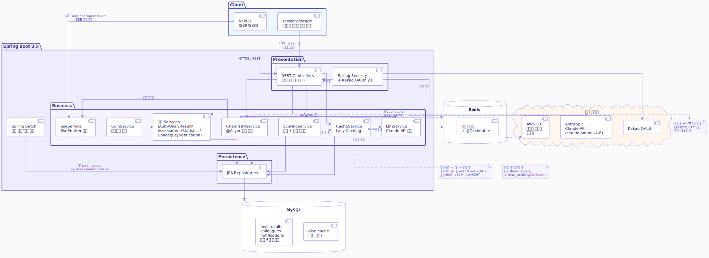
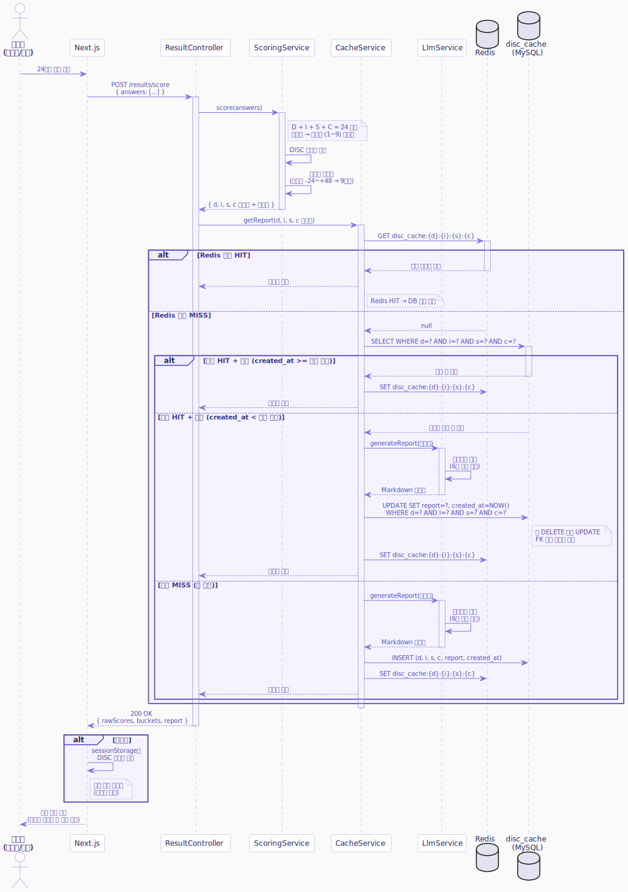
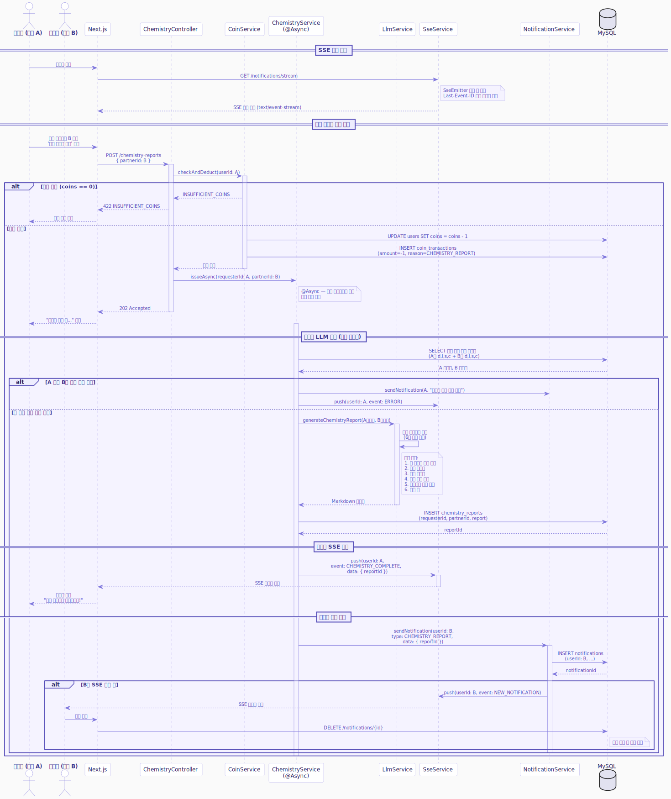
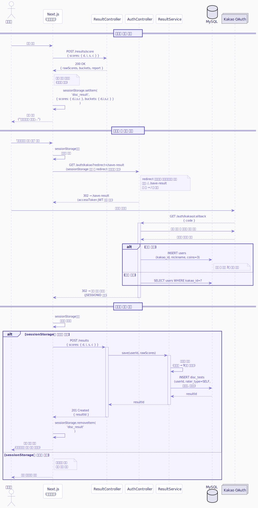
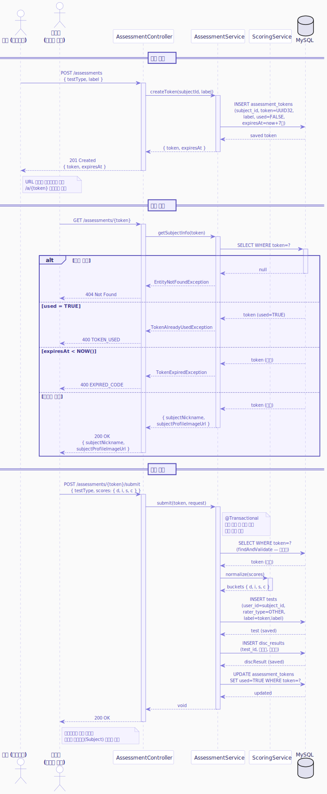

# MyCPT 시스템 아키텍처 설계

**문서 버전**: v0.5
**작성일**: '26.06.05.  
**작성자**: 김유신

---

## 변경 이력

| 버전 | 변경 내용                                                                                      | 날짜       |
| ---- | ---------------------------------------------------------------------------------------------- | ---------- |
| v0.2 | 패키지 루트 com.mycpt.backend로 수정. 컨트롤러 Interface+V1 네이밍 구조 반영. Swagger UI 추가. | '26.05.26. |
| v0.3 | JWT 인증 방식으로 변경에 따른 아키텍처 및 Redis 명세 수정                                      | '26.05.27. |
| v0.4 | Next.js 컴포넌트 역할 추가                                                                     | '26.05.28. |
| v0.5 | 타인 평정 흐름 시퀀스 다이어그램 추가                                                          | '26.06.05  |

---

## 목차

1. [시스템 아키텍처 다이어그램](#1-시스템-아키텍처-다이어그램)
2. [컴포넌트 설명](#2-컴포넌트-설명)
3. [주요 데이터 흐름](#3-주요-데이터-흐름)
4. [Spring 패키지 구조](#4-spring-패키지-구조)

---

## 1. 시스템 아키텍처 다이어그램



---

## 2. 컴포넌트 설명

### 2.1 Client — Next.js

| 역할            | 설명                                                                         |
| --------------- | ---------------------------------------------------------------------------- |
| SSR/SSG         | 초기 페이지 렌더링                                                           |
| sessionStorage  | 비회원 DISC 원점수 임시 보관                                                 |
| SSE 수신        | `/notifications/stream` 연결 유지, 재연결 시 Last-Event-ID 전송              |
| 선택지 셔플     | DISC 태그 미노출 상태에서 클라이언트 셔플 처리                               |
| 원점수 산출     | 24문항 응답 기반 DISC 원점수 계산 (프론트엔드 처리)                          |
| 서버 상태 관리  | TanStack Query — API 캐싱, 로딩/에러 처리, 글로벌 onError(401 자동 로그아웃) |
| 클라이언트 상태 | Zustand — 유저 인증 상태, 시트 열림 여부 등 전역 UI 상태                     |

### 2.2 Spring Boot — 백엔드

| 레이어     | 구성 요소                         | 역할                                                |
| ---------- | --------------------------------- | --------------------------------------------------- |
| Security   | Spring Security + Kakao OAuth 2.0 | 인증/인가. JWT 액세스 토큰 발급(Authorization 헤더) |
| Controller | REST Controllers                  | HTTP 요청 수신, DTO 변환, 응답 반환                 |
| Service    | Business Services                 | 비즈니스 로직, 트랜잭션 경계                        |
| Repository | JPA Repositories                  | DB CRUD                                             |
| Async      | @Async + ThreadPoolTaskExecutor   | 케미 보고서 LLM 비동기 호출                         |
| SSE        | SseEmitter                        | 케미 보고서 완료 푸시, Last-Event-ID 재전송         |
| Batch      | Spring Batch                      | 만료 동료 코드 + 만료 평정 토큰 주기 삭제           |

### 2.3 외부 시스템

| 시스템               | 용도                                                   |
| -------------------- | ------------------------------------------------------ |
| MySQL                | 메인 데이터 저장소 (9개 테이블)                        |
| Redis                | disc_cache @Cacheable (운영 환경)                      |
| Anthropic Claude API | DISC 분석 보고서 생성, 케미 보고서 생성                |
| AWS S3               | 프로필 이미지 저장 (운영 환경. 개발은 로컬 파일시스템) |
| Kakao OAuth          | 소셜 로그인                                            |
| Swagger UI           | API 문서화 및 수동 테스트 (`/swagger-ui`)              |

---

## 3. 주요 데이터 흐름

### 3.1 검사 응시 → 결과 반환 흐름



### 3.2 케미 보고서 발행 흐름 (@Async + SSE)



### 3.3 비회원 → 회원 결과 저장 연계 흐름



### 3.4 타인 평정 흐름 (링크 생성 → 접속 → 제출)



---

## 4. Spring 패키지 구조

```
com.mycpt.backend
├── BackendApplication.java
│
├── config/                          # 설정 클래스
│   ├── SecurityConfig.java          # Spring Security + Kakao OAuth
│   ├── RedisConfig.java             # Redis 연결 및 @Cacheable 설정
│   ├── AsyncConfig.java             # @Async ThreadPoolTaskExecutor
│   ├── BatchConfig.java             # Spring Batch Job/Step 정의
│   └── StorageConfig.java           # 로컬/S3 스토리지 전환 설정
│
├── domain/                          # 도메인별 레이어드 구조
│   ├── result/                      # 검사 결과 (채점, 저장, 이력)
│   │   ├── controller/
│   │   │   └── ResultController.java        # POST /results/score, POST /results, GET /results, GET /results/{id}
│   │   ├── service/
│   │   │   ├── ScoringService.java          # 원점수 검증 + 버킷 정규화
│   │   │   ├── CacheService.java            # disc_cache Lazy Caching
│   │   │   ├── LlmService.java              # Claude API 호출 + 응답 파싱
│   │   │   └── ResultService.java           # 결과 저장 및 이력 조회
│   │   ├── repository/
│   │   │   ├── TestResultRepository.java
│   │   │   └── DiscCacheRepository.java
│   │   └── entity/
│   │       ├── TestResult.java
│   │       └── DiscCache.java
│   │
│   ├── auth/                        # 인증 (Kakao OAuth)
│   │   ├── controller/
│   │   ├── AuthApi.java                    # 인터페이스 (Swagger 문서 + API 계약)
│   │   │   └── AuthV1Controller.java       # GET /auth/kakao, GET /auth/kakao/callback, POST /auth/logout, GET /auth/me
│   │   ├── service/
│   │   │   └── AuthService.java
│   │   └── dto/
│   │       └── KakaoUserInfo.java
│   │
│   ├── user/                        # 회원 프로필
│   │   ├── controller/
│   │   │   └── UserController.java          # PATCH /users/me, POST /users/me/profile-image
│   │   ├── service/
│   │   │   └── UserService.java
│   │   ├── repository/
│   │   │   └── UserRepository.java
│   │   └── entity/
│   │       └── User.java
│   │
│   ├── assessment/                  # 타인 평정
│   │   ├── controller/
│   │   │   └── AssessmentController.java    # POST /assessments, GET /assessments/{token}
│   │   ├── service/
│   │   │   └── AssessmentService.java       # 일회용 토큰 생성/검증, used 처리
│   │   ├── repository/
│   │   │   └── AssessmentTokenRepository.java
│   │   └── entity/
│   │       └── AssessmentToken.java
│   │
│   ├── statistics/                  # 통계
│   │   ├── controller/
│   │   │   └── StatisticsController.java    # GET /statistics/comparison, GET /statistics/trend
│   │   ├── service/
│   │   │   └── StatisticsService.java       # 나이대/성별 집계, 변화 추이
│   │   └── repository/
│   │       └── StatisticsRepository.java
│   │
│   ├── colleague/                   # 동료
│   │   ├── controller/
│   │   │   └── ColleagueController.java     # GET /peer-code, GET /colleagues/invite/{code}, POST /colleagues, GET /colleagues, GET /colleagues/{id}, DELETE /colleagues/{id}
│   │   ├── service/
│   │   │   ├── PeerCodeService.java         # 동료 코드 생성/갱신
│   │   │   └── ColleagueService.java        # 동료 등록/조회/삭제
│   │   ├── repository/
│   │   │   ├── PeerCodeRepository.java
│   │   │   └── ColleagueRepository.java
│   │   └── entity/
│   │       ├── PeerCode.java
│   │       └── Colleague.java
│   │
│   ├── chemistry/                   # 케미 보고서
│   │   ├── controller/
│   │   │   └── ChemistryController.java     # POST /chemistry-reports, GET /chemistry-reports, GET /chemistry-reports/{id}
│   │   ├── service/
│   │   │   ├── ChemistryService.java        # 202 반환 + @Async LLM 호출
│   │   │   └── ChemistryLlmService.java     # 케미 프롬프트 설계 및 보고서 파싱
│   │   ├── repository/
│   │   │   └── ChemistryReportRepository.java
│   │   └── entity/
│   │       └── ChemistryReport.java
│   │
│   ├── notification/                # 알림 + SSE
│   │   ├── controller/
│   │   │   └── NotificationController.java  # GET /notifications/stream, GET /notifications, DELETE /notifications/{id}
│   │   ├── service/
│   │   │   ├── NotificationService.java     # 알림 생성/조회/삭제
│   │   │   └── SseService.java              # SseEmitter 관리, Last-Event-ID 재전송
│   │   ├── repository/
│   │   │   └── NotificationRepository.java
│   │   └── entity/
│   │       └── Notification.java
│   │
│   └── coin/                        # 코인
│       ├── controller/
│       │   └── CoinController.java          # GET /coins
│       ├── service/
│       │   └── CoinService.java             # 온디맨드 충전 (next_coin_at 기반)
│       ├── repository/
│       │   └── CoinTransactionRepository.java
│       └── entity/
│           └── CoinTransaction.java
│
├── common/                          # 공통 유틸
│   ├── exception/
│   │   ├── GlobalExceptionHandler.java      # @RestControllerAdvice
│   │   ├── BusinessException.java
│   │   └── ErrorCode.java                   # INSUFFICIENT_COINS, TOKEN_USED 등
│   ├── response/
│   │   └── ErrorResponse.java               # { code, message } 공통 응답
│   └── storage/
│       ├── StorageService.java              # 인터페이스
│       ├── LocalStorageService.java         # 개발 환경
│       └── S3StorageService.java            # 운영 환경
│
└── batch/                           # Spring Batch
    └── ExpiredDataCleanupBatch.java  # 만료 동료 코드 + 만료 평정 토큰 삭제
```

---

### 패키지 구조 설계 원칙

| 원칙             | 내용                                                                                                       |
| ---------------- | ---------------------------------------------------------------------------------------------------------- |
| 도메인 중심 분리 | 기능별로 `domain/` 하위에 패키지를 나눔. 레이어(controller/service/repository)는 각 도메인 내부에 위치     |
| 의존 방향        | Controller → Service → Repository. 역방향 참조 금지                                                        |
| 트랜잭션 경계    | Service 레이어에서만 `@Transactional` 선언                                                                 |
| 비동기 격리      | `@Async` 메서드는 별도 Service 클래스(`ChemistryLlmService`, `SseService`)로 분리하여 트랜잭션 경계 명확화 |
| 환경별 전환      | `StorageService` 인터페이스로 로컬/S3 구현체를 분리. `@Profile`로 환경별 Bean 등록                         |
| 컨트롤러 버저닝  | 인터페이스({도메인}Api)와 구현체({도메인}V1Controller)로 분리.                                             |
|                  | Swagger 애노테이션은 인터페이스에 집중. 구현체는 로직만 담당.                                              |
|                  | V2 추가 시 {도메인}V2Controller implements {도메인}Api.                                                    |

---

_본 문서는 개발 진행에 따라 지속적으로 업데이트됩니다._
