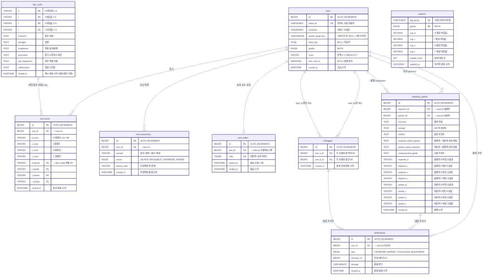

# MyCPT 데이터베이스 설계 문서

**문서 버전**: v0.1
**작성일**: '26.05.23.
**작성자**: 김유신
**연관 문서**: service-design.md v0.5

---

## 목차

- [MyCPT 데이터베이스 설계 문서](#mycpt-데이터베이스-설계-문서)
  - [목차](#목차)
  - [1. 개요](#1-개요)
    - [1.1 테이블 목록](#11-테이블-목록)
    - [1.2 설계 원칙](#12-설계-원칙)
  - [2. ERD](#2-erd)
  - [3. 테이블 명세 (DBML)](#3-테이블-명세-dbml)
  - [4. 인덱스 전략](#4-인덱스-전략)
  - [5. 배치 작업](#5-배치-작업)

---

## 1. 개요

### 1.1 테이블 목록

| 테이블              | 설명                       | 비고                             |
| ------------------- | -------------------------- | -------------------------------- |
| `users`             | 회원 정보                  | 카카오 OAuth 기반                |
| `test_results`      | 검사 결과 이력             | 회원 결과만 저장                 |
| `disc_cache`        | DISC 버킷 기반 보고서 캐시 | 온디맨드 만료, UPDATE 갱신       |
| `coin_transactions` | 코인 충전/차감 이력        | 이상 감지 및 CS 대응 용도        |
| `peer_codes`        | 동료 초대 코드             | 대문자+숫자 8자리, 7일 만료      |
| `colleagues`        | 동료 관계                  | 단일 행 양방향, 작은 ID → user_a |
| `chemistry_reports` | 케미 보고서                | 발행 시점 DISC 스냅샷 포함       |
| `notifications`     | 인앱 알림                  | 클릭 시 즉시 삭제                |
| `statistics`        | 나이대/성별 집계 통계      | 별도 집계 테이블                 |

### 1.2 설계 원칙

- 보고서 원문(disc_cache, chemistry_reports)에는 이름 미포함 저장 — 렌더링 시 이름 삽입
- 비회원 검사 결과는 세션에만 임시 저장, 로그인 후 test_results에 INSERT
- test_results는 원점수 + 버킷값을 함께 저장하여 disc_cache 복합 FK 참조 무결성 보장
- disc_cache는 행 DELETE 없이 UPDATE로 갱신 — FK 참조가 절대 깨지지 않음
- colleagues는 `user_a_id < user_b_id` 규칙으로 UNIQUE 제약만으로 중복 방지
- chemistry_reports는 발행 시점 DISC 버킷값 스냅샷 저장 — 재검사 후에도 보고서 내용 보존

---

## 2. ERD



---

## 3. 테이블 명세 (DBML)

```dbml
// ============================================================
// Enums
// ============================================================

Enum gender_enum {
  M [note: '남성']
  F [note: '여성']
  N [note: '선택 안 함']
}

Enum coin_reason_enum {
  SIGNUP          [note: '가입 시 초기 지급']
  RECHARGE        [note: '24시간 주기 온디맨드 충전']
  CHEMISTRY_REPORT [note: '케미 보고서 발행 차감']
}

Enum notification_type_enum {
  CHEMISTRY_REPORT     [note: '케미 보고서 발행 알림']
  COLLEAGUE_REGISTERED [note: '동료 등록 완료 알림']
}

// ============================================================
// Tables
// ============================================================

Table users [note: '회원 정보. 카카오 OAuth 기반 가입'] {
  id                BIGINT      [pk, increment,   note: '내부 식별자']
  kakao_id          VARCHAR(50) [unique, not null, note: '카카오 고유 식별자']
  nickname          VARCHAR(30) [not null,         note: '서비스 닉네임 (카카오 닉네임 초기값, 수정 가능)']
  profile_image_key VARCHAR(300)[null,             note: '스토리지 오브젝트 키. NULL이면 기본 이미지 사용']
  birth_year        YEAR        [null,             note: '최초 검사 시 입력. NULL이면 미입력 상태']
  gender            gender_enum [null,             note: 'M: 남성, F: 여성, N: 선택 안 함']
  coins             TINYINT     [not null, default: 3, note: '현재 코인 잔액 (0~3)']
  next_coin_at      DATETIME    [null,             note: '다음 코인 충전 예정 시각. NULL이면 만충 상태']
  created_at        DATETIME    [not null,         note: '가입 시각']

  indexes {
    kakao_id [unique, name: 'uq_users_kakao_id']
  }
}

Table test_results [note: '회원 검사 결과 이력. 비회원은 세션 임시 저장 후 로그인 시 INSERT'] {
  id         BIGINT   [pk, increment, note: '내부 식별자']
  user_id    BIGINT   [not null,      note: 'FK → users.id']
  d_score    TINYINT  [not null,      note: 'D 원점수 (-24 ~ +48)']
  i_score    TINYINT  [not null,      note: 'I 원점수']
  s_score    TINYINT  [not null,      note: 'S 원점수']
  c_score    TINYINT  [not null,      note: 'C 원점수']
  d_bucket   TINYINT  [not null,      note: 'D 버킷값 (1~9). disc_cache 복합 FK 구성']
  i_bucket   TINYINT  [not null,      note: 'I 버킷값 (1~9)']
  s_bucket   TINYINT  [not null,      note: 'S 버킷값 (1~9)']
  c_bucket   TINYINT  [not null,      note: 'C 버킷값 (1~9)']
  created_at DATETIME [not null,      note: '검사 완료 시각']

  indexes {
    user_id [name: 'idx_test_results_user_id']
    (d_bucket, i_bucket, s_bucket, c_bucket) [name: 'fk_test_results_disc_cache']
  }
}

Table disc_cache [note: 'DISC 버킷 기반 보고서 캐시. 행 DELETE 없이 UPDATE로 갱신'] {
  d              TINYINT  [not null, note: 'D 버킷값 (1~9). 복합 PK 구성']
  i              TINYINT  [not null, note: 'I 버킷값 (1~9)']
  s              TINYINT  [not null, note: 'S 버킷값 (1~9)']
  c              TINYINT  [not null, note: 'C 버킷값 (1~9)']
  overview       TEXT     [not null, note: '결과 개요. 이름 미포함']
  strengths      TEXT     [not null, note: '강점']
  weaknesses     TEXT     [not null, note: '약점 및 보완책']
  motivation     TEXT     [not null, note: '동기 / 스트레스 요인']
  job_competency TEXT     [not null, note: '직무 역량 관점']
  collaboration  TEXT     [not null, note: '협업 스타일']
  created_at     DATETIME [not null, note: '캐시 생성 시각. 온디맨드 만료 판단 기준']

  indexes {
    (d, i, s, c) [pk]
  }
}

Table coin_transactions [note: '코인 충전/차감 이력. 이상 감지 및 CS 대응 용도'] {
  id            BIGINT           [pk, increment, note: '내부 식별자']
  user_id       BIGINT           [not null,      note: 'FK → users.id']
  amount        TINYINT          [not null,      note: '양수: 충전 / 음수: 차감']
  reason        coin_reason_enum [not null,      note: 'SIGNUP / RECHARGE / CHEMISTRY_REPORT']
  balance_after TINYINT          [not null,      note: '트랜잭션 후 잔액. 이상 감지 용도']
  created_at    DATETIME         [not null,      note: '트랜잭션 발생 시각']

  indexes {
    user_id [name: 'idx_coin_transactions_user_id']
  }
}

Table peer_codes [note: '동료 초대 코드. 사용자당 1행, 7일 만료, 온디맨드 리프레시'] {
  id         BIGINT   [pk, increment, note: '내부 식별자']
  user_id    BIGINT   [unique, not null, note: 'FK → users.id. 사용자당 1행']
  code       CHAR(8)  [unique, not null, note: '대문자+숫자 8자리 랜덤 코드']
  expires_at DATETIME [not null,         note: '만료 시각 (발급 시점 +7일). 배치 삭제 기준']
  created_at DATETIME [not null,         note: '발급 시각']

  indexes {
    user_id    [unique, name: 'uq_peer_codes_user_id']
    code       [unique, name: 'uq_peer_codes_code']
    expires_at [name: 'idx_peer_codes_expires_at']
  }
}

Table colleagues [note: '동료 관계. user_a_id < user_b_id 규칙으로 UNIQUE 제약만으로 중복 방지'] {
  id         BIGINT   [pk, increment, note: '내부 식별자']
  user_a_id  BIGINT   [not null,      note: 'FK → users.id. 두 사용자 중 작은 ID (저장 규칙)']
  user_b_id  BIGINT   [not null,      note: 'FK → users.id. 두 사용자 중 큰 ID (저장 규칙)']
  created_at DATETIME [not null,      note: '동료 관계 생성 시각']

  indexes {
    (user_a_id, user_b_id) [unique, name: 'uq_colleagues_pair']
    user_a_id              [name: 'idx_colleagues_user_a_id']
    user_b_id              [name: 'idx_colleagues_user_b_id']
  }
}

// 양방향 조회 쿼리:
//   SELECT user_b_id AS colleague_id FROM colleagues WHERE user_a_id = ?
//   UNION ALL
//   SELECT user_a_id AS colleague_id FROM colleagues WHERE user_b_id = ?

Table chemistry_reports [note: '케미 보고서. 발행 시점 DISC 스냅샷 포함. 이름 미포함 원문 저장'] {
  id                        BIGINT   [pk, increment, note: '내부 식별자']
  requester_id              BIGINT   [not null,      note: 'FK → users.id. 보고서 발행자']
  partner_id                BIGINT   [not null,      note: 'FK → users.id. 보고서 대상자']
  overview                  TEXT     [not null,      note: '결과 개요']
  synergy                   TEXT     [not null,      note: '시너지 포인트']
  conflict                  TEXT     [not null,      note: '갈등 포인트']
  requester_assists_partner TEXT     [not null,      note: '발행자가 대상자를 보조하는 방법']
  partner_assists_requester TEXT     [not null,      note: '대상자가 발행자를 보조하는 방법']
  communication_guide       TEXT     [not null,      note: '소통 가이드']
  requester_d               TINYINT  [not null,      note: '발행 시점 발행자 D 버킷 스냅샷']
  requester_i               TINYINT  [not null,      note: '발행 시점 발행자 I 버킷 스냅샷']
  requester_s               TINYINT  [not null,      note: '발행 시점 발행자 S 버킷 스냅샷']
  requester_c               TINYINT  [not null,      note: '발행 시점 발행자 C 버킷 스냅샷']
  partner_d                 TINYINT  [not null,      note: '발행 시점 대상자 D 버킷 스냅샷']
  partner_i                 TINYINT  [not null,      note: '발행 시점 대상자 I 버킷 스냅샷']
  partner_s                 TINYINT  [not null,      note: '발행 시점 대상자 S 버킷 스냅샷']
  partner_c                 TINYINT  [not null,      note: '발행 시점 대상자 C 버킷 스냅샷']
  created_at                DATETIME [not null,      note: '발행 시각']

  indexes {
    requester_id [name: 'idx_chemistry_reports_requester_id']
    partner_id   [name: 'idx_chemistry_reports_partner_id']
  }
}

Table notifications [note: '인앱 알림. 클릭 시 즉시 DELETE 처리. 배치 불필요'] {
  id           BIGINT                  [pk, increment, note: '내부 식별자']
  user_id      BIGINT                  [not null,      note: 'FK → users.id. 수신자']
  type         notification_type_enum  [not null,      note: 'CHEMISTRY_REPORT / COLLEAGUE_REGISTERED']
  reference_id BIGINT                  [not null,      note: '관련 엔티티 id (chemistry_reports.id 또는 colleagues.id)']
  message      VARCHAR(255)            [not null,      note: '알림 문구']
  created_at   DATETIME                [not null,      note: '알림 발생 시각']

  indexes {
    (user_id, created_at) [name: 'idx_notifications_user_created']
  }
}

Table statistics [note: '나이대/성별 집계 통계. FK 없는 독립 집계 테이블'] {
  age_group    VARCHAR(10)  [not null, note: '10대/20대/30대 등. 복합 PK 구성']
  gender       gender_enum  [not null, note: 'M/F/N. 복합 PK 구성']
  avg_d        DECIMAL(4,2) [not null, note: 'D 평균 버킷값']
  avg_i        DECIMAL(4,2) [not null, note: 'I 평균 버킷값']
  avg_s        DECIMAL(4,2) [not null, note: 'S 평균 버킷값']
  avg_c        DECIMAL(4,2) [not null, note: 'C 평균 버킷값']
  sample_count INT          [not null, note: '집계 표본 수']
  updated_at   DATETIME     [not null, note: '마지막 집계 시각']

  indexes {
    (age_group, gender) [pk]
  }
}

// ============================================================
// References
// ============================================================

Ref: test_results.user_id            > users.id
Ref: test_results.(d_bucket, i_bucket, s_bucket, c_bucket) > disc_cache.(d, i, s, c)

Ref: coin_transactions.user_id       > users.id

Ref: peer_codes.user_id              > users.id

Ref: colleagues.user_a_id            > users.id
Ref: colleagues.user_b_id            > users.id

Ref: chemistry_reports.requester_id  > users.id
Ref: chemistry_reports.partner_id    > users.id

Ref: notifications.user_id           > users.id
```

---

## 4. 인덱스 전략

| 테이블              | 인덱스                                     | 용도                                   |
| ------------------- | ------------------------------------------ | -------------------------------------- |
| `users`             | `UNIQUE(kakao_id)`                         | 카카오 로그인 시 회원 조회             |
| `test_results`      | `(user_id)`                                | 결과 이력 조회, 최신 결과 조회         |
| `test_results`      | `(d_bucket, i_bucket, s_bucket, c_bucket)` | disc_cache 복합 FK                     |
| `coin_transactions` | `(user_id)`                                | 사용자별 코인 이력 조회                |
| `peer_codes`        | `UNIQUE(user_id)`                          | 사용자 코드 조회 (온디맨드 리프레시)   |
| `peer_codes`        | `UNIQUE(code)`                             | 코드 입력/링크 접근 시 조회            |
| `peer_codes`        | `(expires_at)`                             | 배치 삭제 조건                         |
| `colleagues`        | `UNIQUE(user_a_id, user_b_id)`             | 중복 등록 방지                         |
| `colleagues`        | `(user_a_id)`, `(user_b_id)` 각각          | UNION ALL 양방향 조회 인덱스 독립 탐색 |
| `chemistry_reports` | `(requester_id)`                           | 내가 발행한 보고서 조회                |
| `chemistry_reports` | `(partner_id)`                             | 나를 대상으로 발행된 보고서 조회       |
| `notifications`     | `(user_id, created_at)`                    | 알림 목록 조회                         |

---

## 5. 배치 작업

| 작업                | 대상 테이블  | 조건                 | 주기      |
| ------------------- | ------------ | -------------------- | --------- |
| 만료 동료 코드 삭제 | `peer_codes` | `expires_at < NOW()` | 매일 새벽 |

> **disc_cache 초기화 배치 없음**: 온디맨드 만료 방식으로 대체. 조회 시 `created_at` 기준으로 만료 여부 확인 후 해당 행만 UPDATE 갱신.
>
> **알림 삭제 배치 없음**: 알림 클릭 시 즉시 DELETE 처리.

---

_본 문서는 service-design.md와 함께 관리되며, 스키마 변경 시 동시 업데이트합니다._
