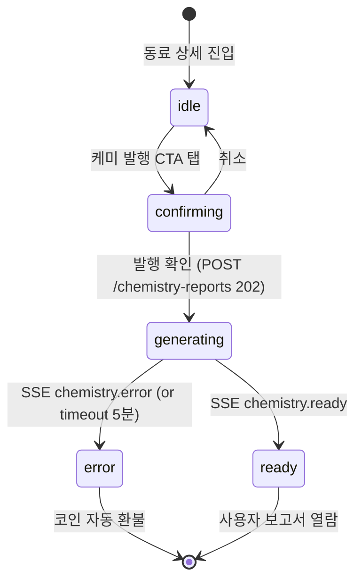
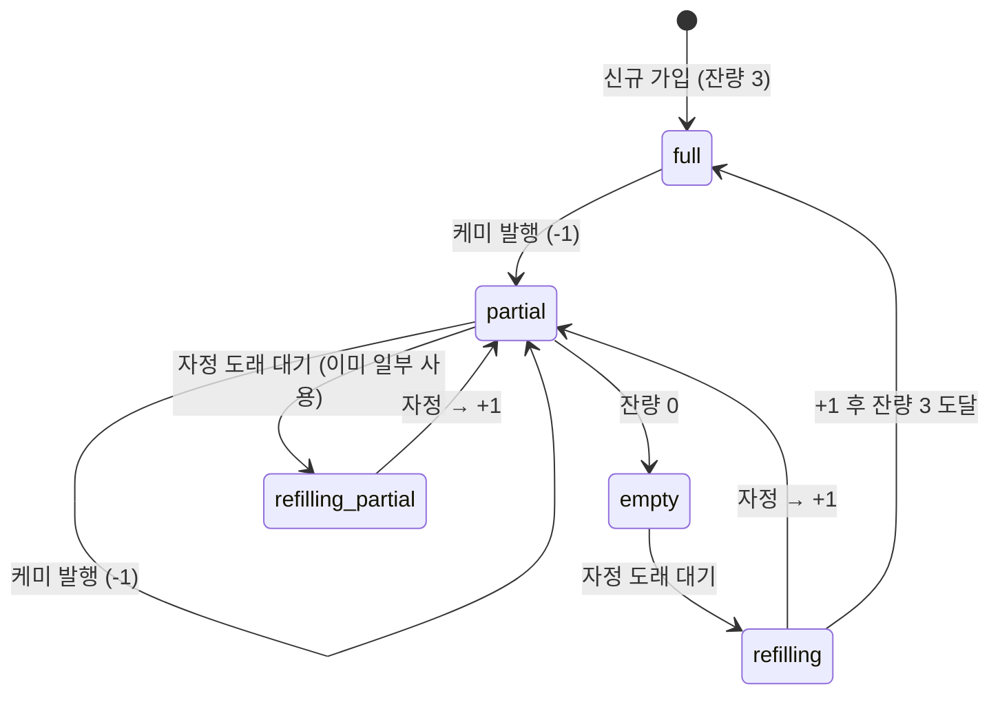
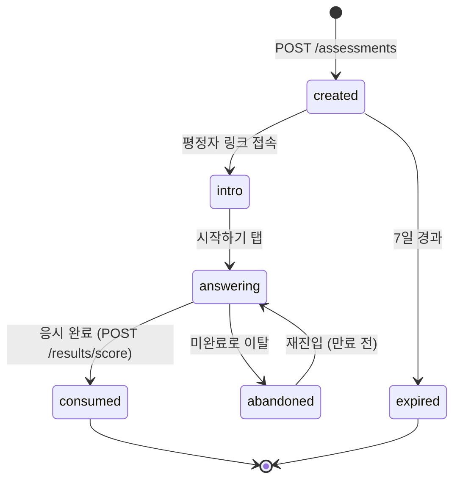
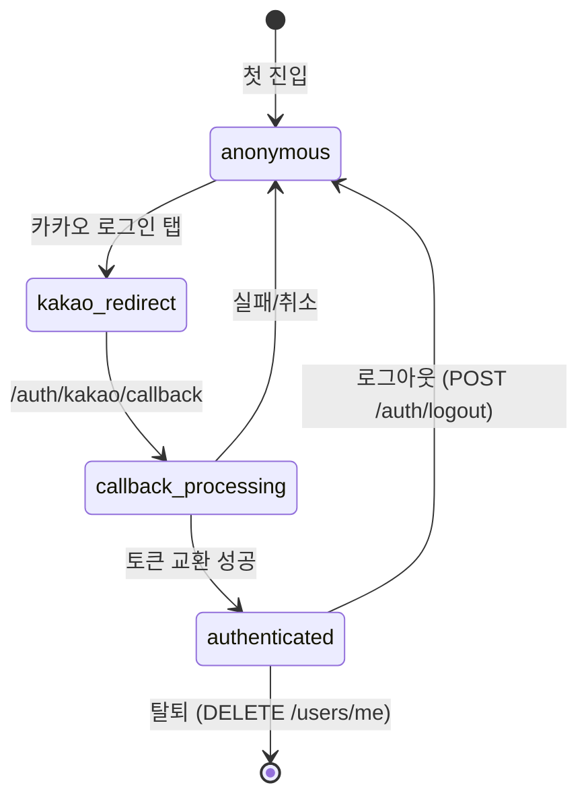
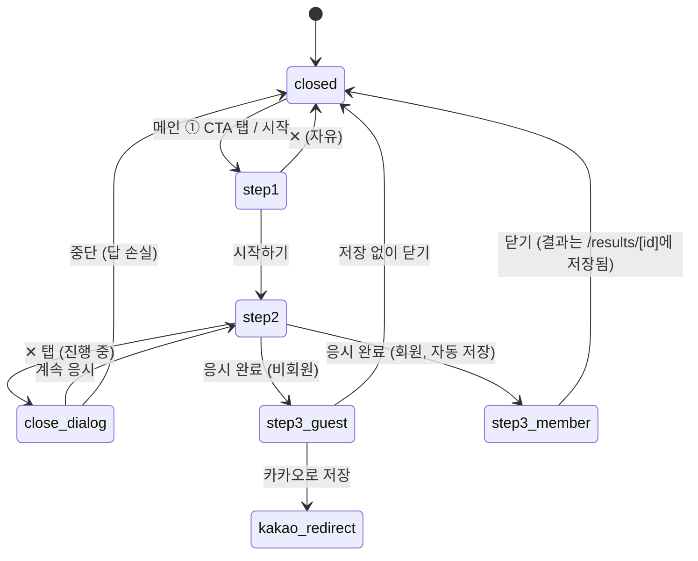
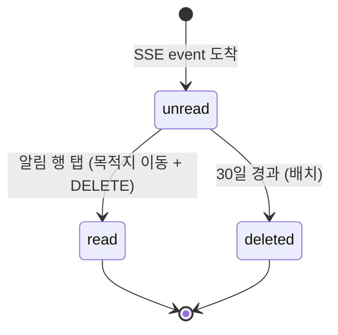
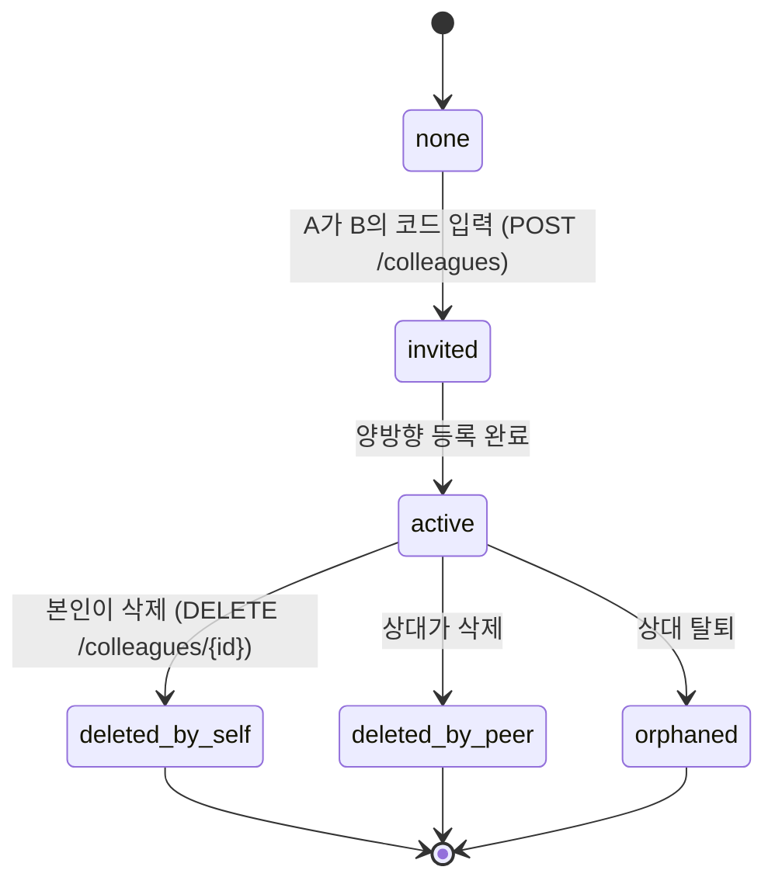

# MyCPT — 상태 머신 명세 (State Machines)

> 비동기 흐름·시간 기반 상태 전이를 명시. 와이어프레임에 텍스트로 산재된 상태 전이 정보를 한 곳에 모은 SSOT.

**version**: 0.1
**관련 화면**: `specs/screens.yaml`
**관련 API**: `docs/api-design.md`

---

## 1. 케미 보고서 (Chemistry Report)

가장 복잡한 비동기 흐름. AI 본문 생성에 30초~1분 걸려, 발행 즉시 UI에 자리를 잡고 SSE 완료 이벤트로 갱신됨.

| 상태         | UI 표현                                                                                              | 사용자 인터랙션                              |
| ------------ | ---------------------------------------------------------------------------------------------------- | -------------------------------------------- |
| `idle`       | 일반 동료 상세 화면. 발행 CTA 활성 (코인 ≥ 1)                                                        | 발행 CTA 탭                                  |
| `confirming` | `chemistry-confirm-modal` 다이얼로그                                                                 | 확인/취소                                    |
| `generating` | chemistry-list에 점선 테두리 카드 + 스피너. chemistry-detail 진입 시 hero(두 아바타) + skeleton 본문 | 닫고 다른 화면 이동 가능, 알림 받으면 돌아옴 |
| `ready`      | chemistry-list 카드에 NEW 뱃지. detail 본문 마크다운 렌더                                            | 열람                                         |
| `error`      | 토스트 "발행에 실패했어요. 코인이 환불되었어요." + 재시도 버튼                                       | 재시도                                       |

**예외 처리**

- `generating` 중 동료가 탈퇴 → 발행 취소, 코인 환불, 토스트 안내
- 5분 타임아웃 시 자동 `error`
- 동시 발행 제한: 같은 동료에 대해 `generating`이 있으면 새 발행 차단

---

## 2. 코인 (Coin Balance)

| 상태      | 잔량 | UI 표현                                                     |
| --------- | ---- | ----------------------------------------------------------- |
| `full`    | 3    | CoinPill 타이머 "00:00" (충전 불필요), 코인 슬롯 3/3 채워짐 |
| `partial` | 1~2  | CoinPill 타이머 "23:14" 등 카운트다운, 슬롯 일부 빔         |
| `empty`   | 0    | 케미 발행 CTA 비활성 + 다음 충전 시간 안내                  |

**규칙**

- 매일 **자정 (KST 00:00)**에 1개 충전
- 최대 보관 3개
- 케미 발행 실패 시 자동 환불

---

## 3. 외부 평정 토큰 (Assessment Token)

| 상태        | UI 표현                                                                   |
| ----------- | ------------------------------------------------------------------------- |
| `created`   | 평정자에게 카톡으로 전달된 직후                                           |
| `intro`     | `assessment-intro` 화면 (인사 + 응시 방법)                                |
| `answering` | `test-sheet-step2`와 동일 화면 (rater=OTHER)                              |
| `consumed`  | "감사합니다" 종료 화면. 같은 링크 재접근 시 "이미 응시가 완료된 링크예요" |
| `expired`   | "초대장이 만료됐어요" 안내                                                |

**규칙**

- 토큰 1개 = 1회용
- 만료 기간 7일 (TBD — docs/api-design.md 확인 필요)

---

## 4. 인증 상태 (Auth)

| 상태                  | UI 표현                                      | 회원 전용 동선                                                |
| --------------------- | -------------------------------------------- | ------------------------------------------------------------- |
| `anonymous`           | 헤더 우측 "카카오로 시작" 버튼, ② ③ CTA 잠금 | 검사 응시 (Step 3 비회원 결과만), 서비스 소개, 외부 평정 응시 |
| `kakao_redirect`      | 카카오 화면으로 이동 (외부)                  | —                                                             |
| `callback_processing` | `kakao-callback` 인터스티셜 (1~2초)          | —                                                             |
| `authenticated`       | 헤더 칩(닉네임 + 사진) + CoinPill + 알림 종  | 모든 기능                                                     |

**팁**

- 회원 전용 CTA를 비회원이 탭하면 LockedToast 표시 (검정 토스트 + 카카오 액션)
- 로그인 후 원래 가려던 곳(`returnTo`)으로 리다이렉트

---

## 5. 검사 시트 (Test Sheet)

| Step              | 닫기 가능          | 데이터 손실      |
| ----------------- | ------------------ | ---------------- |
| 1 (유형 선택)     | ✓ 자유             | 없음             |
| 2 (응시 중)       | 다이얼로그 확인 후 | 모든 답변        |
| 3 (결과 — 비회원) | ✓ 자유             | 회원 저장 안 함  |
| 3 (결과 — 회원)   | ✓ 자유             | 이미 자동 저장됨 |

---

## 6. 알림 (Notification)

| 상태      | 표현                                                 |
| --------- | ---------------------------------------------------- |
| `unread`  | 옅은 노란 배경 + 우측 빨간 점. 헤더 종 뱃지 카운트 ↑ |
| `read`    | 즉시 삭제됨 (별도 "읽음" 상태 없음 — UI 단순화)      |
| `deleted` | 사라짐                                               |

**규칙**

- 알림 행 탭 = 목적지 이동 + 즉시 삭제 (읽음 처리 X)
- 30일 이전은 자동 삭제 (배치)
- "모두 읽음" = 일괄 삭제

---

## 7. 동료 관계 (Colleague Relationship)

| 상태              | 본인 화면                                                 | 상대 화면      |
| ----------------- | --------------------------------------------------------- | -------------- |
| `active`          | 동료 카드 노출, 케미 발행 가능                            | 동료 카드 노출 |
| `deleted_by_self` | 사라짐 (이전 케미 보고서는 본인 이력에 유지)              | 사라짐         |
| `deleted_by_peer` | 사라짐 (자동)                                             | 사라짐         |
| `orphaned`        | 사라짐, 단 케미 보고서 상세에 "이 동료가 탈퇴했어요" 라벨 | —              |

---

## 상태 ↔ API 이벤트 매핑

| 상태 변화                           | 트리거 API/이벤트                               |
| ----------------------------------- | ----------------------------------------------- |
| `chemistry.idle → generating`       | `POST /chemistry-reports` (202)                 |
| `chemistry.generating → ready`      | SSE `chemistry.ready`                           |
| `chemistry.generating → error`      | SSE `chemistry.error`                           |
| `coin.* → -1`                       | `POST /chemistry-reports` 성공                  |
| `coin.* → +1`                       | 자정 배치 (서버)                                |
| `session.anonymous → authenticated` | `/auth/kakao/callback` 성공                     |
| `assessment.created → consumed`     | `POST /results/score` (rater=OTHER, with token) |
| `notification.unread → deleted`     | `DELETE /notifications/{id}`                    |
| `colleague.none → active`           | `POST /colleagues` 성공 (양방향)                |
