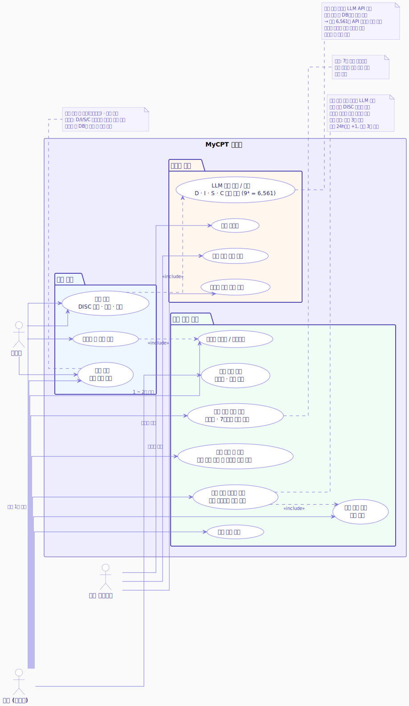

# MyCPT 요구사항 명세서

> **My ComPeTency**
> DISC 이론 기반 직무 역량 성향 분석 서비스

**문서 버전**: v0.1
**작성일**: '26.05.24.
**작성자**: 김유신
**연관 문서**: service-design.md v0.6 / api-design.md v0.3 / database-design.md v0.5

---

## 변경 이력

| 버전 | 변경 내용                                                           | 날짜       |
| ---- | ------------------------------------------------------------------- | ---------- |
| v0.1 | service-design.md v0.5에서 요구사항 관련 섹션 분리 및 변경사항 반영 | '26.05.24. |

---

## 목차

1. [사용자 정의](#1-사용자-정의)
2. [기능 요구사항](#2-기능-요구사항)
3. [비기능 요구사항](#3-비기능-요구사항)
4. [유즈케이스 정의](#4-유즈케이스-정의)
5. [MVP 범위](#5-mvp-범위)

---

## 1. 사용자 정의

### 1.1 비회원

- 카카오 로그인 없이 검사 응시 가능
- 검사 응시 횟수 제한 없음 (LLM 캐싱으로 비용 방어)
- 검사 완료 시 DISC 원점수를 클라이언트 sessionStorage에 임시 보관 (서버 세션 미발급 — 플러딩 방어)
- 통계 반영 및 결과 저장은 로그인 후에만 가능
- '로그인하고 결과 저장' 버튼을 통해 카카오 로그인 시 sessionStorage의 원점수를 서버로 전송하여 저장
- 결과 화면의 이름 표시는 '사용자'로 통일 (예: "사용자님의 강점은...")
- 타인 평정 링크("나는 어떤 사람인가요?")를 통해 비회원도 타인 평정 응시 가능

### 1.2 회원 (카카오 로그인)

- 검사 응시 횟수 제한 없음
- 검사 결과 이력 저장 및 조회 (자기 평정 / 타인 평정 구분)
- 결과 화면의 이름 표시는 카카오 닉네임 사용 (예: "유신님의 강점은...")
- 카카오 로그인 후 프로필 설정 시 생년/성별 입력 가능 (선택 사항)
- 나이대/성별 기준 타인 통계 비교 (생년/성별 입력 회원만, 자기 평정 결과만 집계)
- 자기 평정 결과 변화 추이 조회
- 동료 코드를 통한 동료 초대 및 동료 목록 관리
- 타인 평정 링크 생성 ("나는 어떤 사람인가요?") — 코인 소모 없음
- 동료 케미 보고서 발행 (코인 차감)
- 코인 시스템을 통한 동료 케미 보고서 발행 횟수 관리

---

## 2. 기능 요구사항

### 2.1 검사 기능

| ID   | 기능           | 설명                                                     | 대상             |
| ---- | -------------- | -------------------------------------------------------- | ---------------- |
| F-01 | 검사 응시      | 24문항 강제선택 방식으로 검사 진행, 횟수 제한 없음       | 비회원/회원      |
| F-02 | 결과 확인      | DISC 점수, 강점/약점 분석 확인                           | 비회원/회원      |
| F-03 | 결과 저장      | 로그인 후 sessionStorage의 원점수를 서버로 전송하여 저장 | 비회원→회원 전환 |
| F-04 | 결과 이력 조회 | 과거 검사 결과 목록 및 상세 조회 (자기/타인 평정 구분)   | 회원             |

### 2.2 통계 기능

| ID   | 기능               | 설명                                                            | 대상 |
| ---- | ------------------ | --------------------------------------------------------------- | ---- |
| F-05 | 나이대별/성별 비교 | 동일 나이대/성별 평균 DISC 버킷값과 비교. 자기 평정 결과만 집계 | 회원 |
| F-06 | 변화 추이 조회     | 자기 평정 결과의 기간별 변화 추이 및 평균                       | 회원 |

### 2.3 타인 평정 기능

| ID   | 기능                | 설명                                                                                     | 대상        |
| ---- | ------------------- | ---------------------------------------------------------------------------------------- | ----------- |
| F-07 | 타인 평정 링크 생성 | "나는 어떤 사람인가요?" 일회용 링크 생성. 라벨 입력으로 평정자 식별 가능. 코인 소모 없음 | 회원        |
| F-08 | 타인 평정 응시      | 링크 접속 후 24문항 응시. 결과는 피평정자 계정에 귀속. 단 1회만 응시 가능                | 비회원/회원 |

### 2.4 케미 기능

| ID   | 기능                  | 설명                                                                                      | 대상 |
| ---- | --------------------- | ----------------------------------------------------------------------------------------- | ---- |
| F-09 | 동료 코드 생성        | 나의 고유 동료 초대 코드 생성 및 확인. 대문자+숫자 8자리, 다회용, 7일마다 자동 갱신       | 회원 |
| F-10 | 동료 초대 및 등록     | 초대 링크 또는 코드 직접 입력을 통해 양방향 동료 관계 등록                                | 회원 |
| F-11 | 동료 케미 보고서 발행 | 동료 목록에서 대상 선택 후 코인 1개 차감, 비동기 LLM 호출로 케미 보고서 생성 및 상대 알림 | 회원 |
| F-12 | 알림                  | 케미 보고서 발행 완료 및 동료 등록 시 인앱 알림. SSE 실시간 푸시. 클릭 시 즉시 삭제       | 회원 |

### 2.5 인증/프로필 기능

| ID   | 기능          | 설명                                           | 대상   |
| ---- | ------------- | ---------------------------------------------- | ------ |
| F-13 | 카카오 로그인 | 카카오 OAuth 2.0 기반 소셜 로그인              | 비회원 |
| F-14 | 로그아웃      | 세션 종료 및 로그아웃                          | 회원   |
| F-15 | 프로필 설정   | 닉네임, 생년, 성별, 프로필 이미지 설정 및 수정 | 회원   |

---

## 3. 비기능 요구사항

### 3.1 성능

- 캐시 히트 시 결과 응답 시간 **1초 이내**
- LLM 호출 시 결과 응답 시간 **10초 이내** (비동기 처리 + SSE 푸시)
- `disc_cache` 반복 조회: Redis `@Cacheable` 적용으로 DB 접근 최소화 (배포 후 2단계)

### 3.2 보안

- 카카오 수집 정보는 서비스 목적 외 사용 금지
- 개인정보처리방침 동의 후 서비스 이용 가능
- 비회원에게 서버 세션 미발급 — 세션 플러딩 방어
- 동료 초대 코드는 7일 주기 갱신으로 코드 유추를 통한 타인 성향 열람 방어
- 타인 평정 링크는 일회용 토큰 + 만료 7일로 중복 제출 방어
- 프로필 이미지 업로드: jpg/png/webp, 10MB 이하 서버 검증 필수

### 3.3 확장성

- 버킷 캐시 구조로 사용자 증가 시에도 LLM 비용 선형 증가 없음
- 통계 데이터 증가에 대비한 집계 테이블 별도 관리
- `chemistry_reports.test_type` 컬럼으로 MBTI, Big5 등 다중 검사 유형 확장 대비
- `GET /results`의 `type`, `rater` 파라미터로 검사 유형/평정자 유형 필터링 확장 대비

### 3.4 운영

- `disc_cache` 만료: 온디맨드 방식으로 조회 시 자동 갱신 (배치 불필요)
- 만료 동료 코드 / 만료 평정 토큰 삭제: 배치 스케줄러로 매일 새벽 통합 실행
- 알림 삭제: 클릭 시 즉시 삭제 (배치 불필요)
- 세션 저장소: 서버 메모리 (개발) → Redis (운영 배포 전 적용)
- 스토리지: 로컬 (개발) → AWS S3 (운영 배포 전 적용)
- 서비스 면책 조항 명시: "본 결과는 참고용 성향 분석이며 심리 진단이 아닙니다"

---

## 4. 유즈케이스 정의

### 4.1 유즈케이스 다이어그램

> PlantUML 원본: `UML/usecase.puml`

### 4.2 주요 유즈케이스 시나리오

#### UC-01. 비회원 검사 응시 및 결과 저장

1. 사용자가 메인 페이지에서 '검사 시작' 클릭
2. 24문항 강제선택 방식으로 검사 진행 (선택지 셔플은 클라이언트 처리)
3. DISC 원점수 산출 → 버킷 분류 → 캐시 조회
   - 캐시 히트 + 유효: DB에서 분석 결과 즉시 반환
   - 캐시 히트 + 만료: LLM API 호출 → 결과 UPDATE 후 반환
   - 캐시 미스: LLM API 호출 → 결과 INSERT 후 반환
4. 클라이언트 sessionStorage에 DISC 원점수 임시 보관
5. 결과 화면에서 "사용자님의 강점/약점" 분석 확인
6. '로그인하고 결과 저장' 버튼 클릭 → 카카오 로그인 → sessionStorage의 원점수를 `POST /results`로 전송 → `test_results`에 INSERT

#### UC-02. 타인 평정 ("나는 어떤 사람인가요?")

1. 회원 A가 타인 평정 링크 생성 → 라벨 입력 (예: "여자친구") → 일회용 토큰 발급
2. A가 링크를 대상자에게 공유
3. 대상자가 링크 접속 → 24문항 응시 (A의 성향을 평정하는 문항)
4. 응시 완료 → `POST /assessments/{token}/submit` 호출 → 채점, tests/disc_results 저장(rater_type=OTHER, label=여자친구), 토큰 used=TRUE 처리가 단일 트랜잭션으로 실행 → 결과가 A의 계정에 귀속. 응시자에게는 결과 미노출.
5. 토큰 `used=TRUE` 처리 → 동일 링크 재접속 차단
6. A의 결과 이력에서 자기 평정 / 타인 평정 구분하여 조회 가능

#### UC-03. 회원 동료 초대 및 케미 보고서 발행

1. 회원 A가 동료 코드 확인 → 초대 링크 생성 또는 코드 직접 공유
2. B가 링크 접속 또는 코드 직접 입력 → 동료 등록 완료 (A↔B 양방향 관계 생성)
3. A 또는 B가 동료 목록에서 상대 선택 → '케미 보고서 발행' 클릭
4. 보유 코인 확인 후 코인 1개 차감
5. `@Async`로 두 사람의 최신 자기 평정 DISC 버킷값 기반 실시간 LLM 호출
6. 케미 보고서를 Markdown 형식으로 저장 (DISC 버킷 스냅샷 미포함 — 보고서 텍스트로 충분)
7. SSE로 발행자에게 완료 푸시 → 토스트 알림 표시
8. 상대방에게 인앱 알림 전송
9. 알림 클릭 → 보고서 확인 → 알림 즉시 삭제

---

## 5. MVP 범위

### 포함

- [x] 검사 응시 (24문항 강제선택, 횟수 제한 없음)
- [x] DISC 점수 산출 및 버킷 분류
- [x] LLM 캐시 기반 개인 분석 결과 제공 (온디맨드 만료)
- [x] 비회원 sessionStorage 임시 저장 및 로그인 후 결과 저장
- [x] 카카오 로그인/로그아웃
- [x] 프로필 설정 (닉네임, 생년, 성별, 프로필 이미지 업로드/교체)
- [x] 결과 이력 조회 (자기 평정 / 타인 평정 구분, 커서 기반 페이지네이션)
- [x] 나이대/성별 통계 비교 (자기 평정 결과만 집계)
- [x] 자기 평정 변화 추이 조회
- [x] 타인 평정 링크 생성 및 응시 ("나는 어떤 사람인가요?")
- [x] 동료 코드 생성 및 동료 초대/등록 (링크 + 직접 입력)
- [x] 동료 케미 보고서 발행 (코인 시스템, 비동기 LLM, SSE 푸시)
- [x] 케미 보고서 발행 시 상대방 인앱 알림 (SSE 실시간 + 클릭 시 즉시 삭제)
- [x] 만료 동료 코드 / 만료 평정 토큰 삭제 배치

### 제외 (추후 추가)

- [ ] MBTI, Big5 등 다른 검사 유형
- [ ] 관리자 대시보드
- [ ] 캐시 수동 초기화 UI
- [ ] 이메일/SNS 결과 공유
- [ ] 다국어 지원

---

_본 문서는 요구사항 변경 시 api-design.md, database-design.md와 함께 업데이트합니다._
